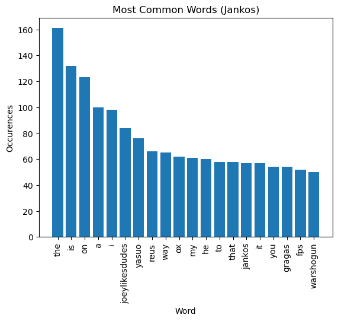
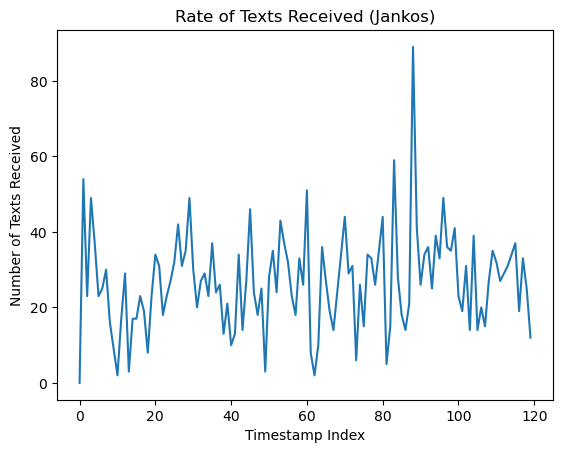
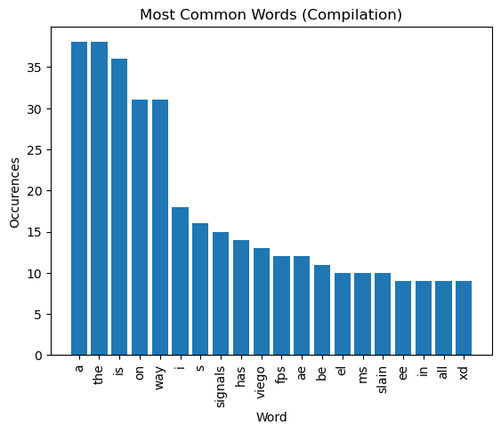
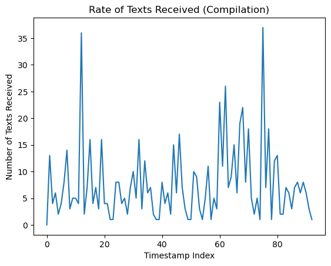
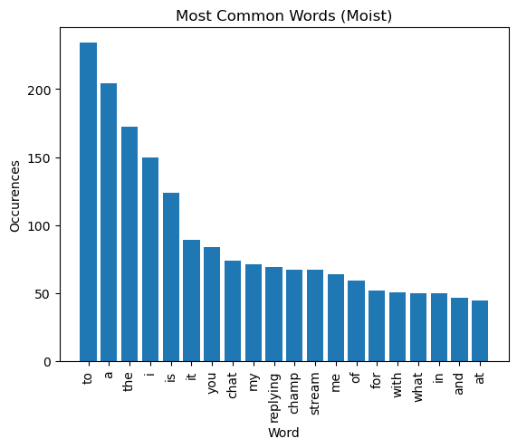

# Results

For results, I record the time needed to process various videos and basic analysis of the logs.

In the future, I'd like to extend this by hitting [this api](https://discuss.dev.twitch.tv/t/getting-chat-replay-transcript/5295) in smart ways to have a ground truth to compare against for chat.

## System Specs

Everything is run locally on my 2019 MacBook pro. Forced cpu instead of gpu whereever possible in models to simulate worst possible conditions. 16GB i7 RAM.

## Single Streamer (League)

The video analyzed is ten minutes of stream from [this vod](https://www.twitch.tv/videos/1826440893) at 47:00-57:00. This was the primary video I worked with as I was prototyping as the consistent layout made classifying boxes slightly easier.

### Real-time Factor: 1.4

Breakdown of time:

- Frame extraction - 0:26
- Pre-processing - 1:26
- Classification (including time of user input) - 0:54
- Processing - 3:54

### Most Common Words



### Rate of Text



### Text Sample

```
["00:00:35", " Streamlabs » Find me on my instagram profile! "],
["00:00:35", " Instagram comijankas iol "],
["00:00:35", " "],
["00:00:35", " @ dazed_03 shinwinter ¢ "],
["00:00:35", "  "],
["00:00:35", "   "],
["00:00:40", " OWLOFNIGHT "],
["00:00:40", " L ‘Kinda chad idk "],
["00:00:40", " Jankos just be "],
["00:00:40", " Bhd hist act lke We Intended "],
["00:00:40", " ‘Streamlabs » Find me on my instagram profile "],
["00:00:40", " lecrum:cornifiriiies Mt: "],
["00:00:40", " BECCA | Usb sCOPEE STL ay "],
["00:00:40", " Miystial.ore''ei just go ap build no more sup == "],
["00:00:40", " IS Soe "],
```

## Multiple Streamers (League)

Original video is from the problem description and found [here](https://drive.google.com/file/d/15tKqF_WVR29BIZe02tptqJbY0dVcU5Yr/view?usp=drive_link). It contains highlights from various streamers.

This video is more challenging because each streamer places text overlays in different places, and because there are things like cuts, effects, zoom in / out that happen sporadically.

### Real-time Factor: 1.37

Breakdown of time:

- Frame extraction - 0:34
- Pre-processing - 1:31
- Classification (including time of user input) - 1:00
- Processing - 3:06

### Most Common Words



Note that this is only the subset of the data flagged HUD.

### Rate of Text



Note that this is only the subset of the data flagged HUD.

### Text Sample

```
["00:00:00", " "],
["00:00:00", " Le ee eee EE en ed "],
["00:00:00", " [19:49] Thebausffs (Zac) is legendary! "],
["00:00:00", " [19:51] Shending el HP (Shen) signals that enemies are missing "],
["00:00:00", " [19:51] Shending el HP (Shen) is godlike! "],
["00:00:00", " [19:53] Shending el HP (Shen): Redemption - 86s "],
["00:00:00", " [19:55] Tliist (Yasuo): Baron Nashor - Spawning in 0:05 "],
["00:00:00", " [19:55] TliGist (Yasuo): Baron Nashor - Spawning in 0:05 "],
["00:00:00", " [20:13] Shending el HP (Shen): Hextech Drake - Spawning in 2: 4 "],
["00:00:00", " 01a Ghendingel MP iahen} Hextech' Drakes Spawning in "],
["00:00:00", "  "],
["00:00:05", "   "],
["00:00:05", " A1O/ = © 20:21 "],
["00:00:05", " FPS-136  97ms "],
```

## Single Streamer (Overwatch)

The video analyzed is ten minutes of stream from [this vod](https://www.youtube.com/watch?v=r5oZTX09u0o) at 44:00-50:00.

### Real-time Factor: 1.07

Breakdown of time:

- Frame extraction - 0:24
- Pre-processing - 1:08
- Classification (including time of user input) - 0:55
- Processing - 3:30

### Most Common Words



### Rate of Text


### Text Sample

```
["00:00:40", " ©, Lieutenantorip_: i * "],
["00:00:40", " mimsycookie: © © "],
["00:00:45", " STREAM CHAT "],
["00:00:50", "   "],
["00:00:50", " a ONLY AVAILABLE TO "],
["00:00:50", " M (ST mouTmenacow THE GROUP LEADER. "],
["00:00:50", " €) WHILE YOU WAIT "],
["00:00:55", " ONLY AVAILABLE TO "],
["00:00:55", " THE GROUP LEADER. "],
["00:00:55", "  "],
["00:00:55", " zingirda WH theg_h_o_w) jit 150 "],
["00:00:55", " 152 BE CHAMP 1977 if 120 "],
["00:00:55", " destroyer_melvin "],
["00:00:55", " "],
["00:00:55", " is gifting 1 Tier 1 Sub to moisterttikal's "],
["00:00:55", " community. They've gifted a total of 3 "],
["00:00:55", " in the channel! "],
```
