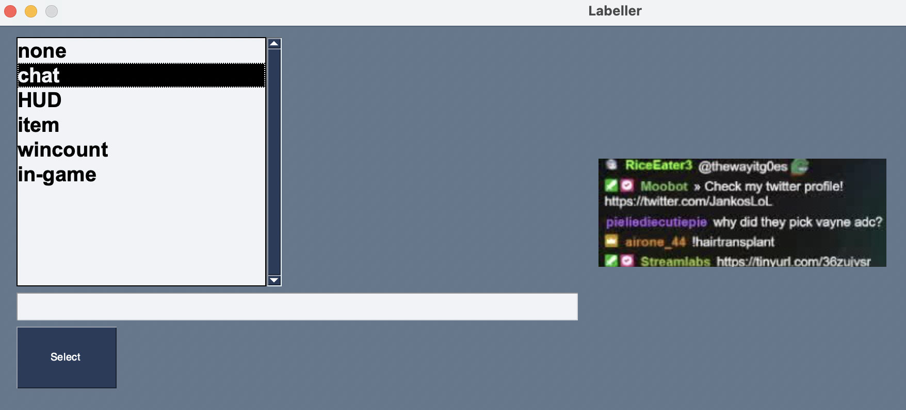

# System Overview

This document outlines my approach to solving the universal text reader problem. Some nitty-gritty problems/fixes are omitted,as this document is intended to give the overall shape of my solution and how I iterated.

## High Level Solution

In order to solve this problem robustly in a way that would lead to a good user experience, I decided on the following flow.

1. We **pre-process** the stream and aim to identify the different kinds text that appear. We simply use existing OCR (tessaract) to find the boxes, and then solicit precise (and convenient) user input to label the different blocks.

2. Once this is done, we extract all of these representative blocks and train a **classifier** that — given a region predicted to contain text (by tessaract) — can efficiently predict what kind of box it is. To keep things performant, we do feature extraction followed by simple clustering.

3. Finally, we **process** the data at the highest granularity (number of frames analyzed per second) that our system can handle while maintaining a real-time factor comfortably above 1. Processing involves:
   - Predicting what class of text group this is.
   - Extracting text with rich formatting.
   - Comparing the text now vs the text at the last (few) timestep(s).
   - Determining what is new and adding the timestamped changes to the file tracking this group.

In step 1, the user will identify certain classes of text they're interested in (say class A, class B, ...). The result after step 3 will be a collection of `.json` files (e.g. `A.json`) which contains _only changes_ timestamped appropriately. So for instance, if we're tracking the in game chat, it might look like:

# Pre-processing

Preprocessing consists of two steps.

## 1. Extract frames from the video

This is a simple step that simply uses `ffmpeg` to get frames. The rate at which frames are taken is the biggest determinant of performance. **From observation, taking one frame every 5 seconds** is a happy medium, yielding around a 1.5 real-time factor while still capturing the most important game state.

## 2. Identify boxes from each frame and extract images

Next, we analyze each frame using tesseract to predict the regions most likely to contain text. We expose a parameter `conf_threshold` that conditions boxes on the confidence metric built into tesseract.

Using tesseract, I found that simply taking the boxes predicted as is likely is not a good solution. The biggest reason is because between frames variation in background and text makes it so that sometimes text is predicted as a single box, whereas other times it is predicted as multiple. Consider the in-game chat (left) on the images below:

  
&nbsp; &nbsp; &nbsp; &nbsp;
  

Between these two sequential frames, the bounding box given by tesseract around the in-game chat changes signficantly.

### Merging boxes

To solve this I implemented a lightweight merge which would identify boxes that were similar shapes and close neighbors and look to combine them so that boxes were as consistent as possible between frames.

### Custom Image Binarization

I also noticed that the model as I had been using it struggled with different colored backgrounds. I added in a step which binarized the images as they came in (before tessaract) to hopefully make the job of OCR easier.

  
&nbsp; &nbsp; &nbsp; &nbsp;
  
&nbsp; &nbsp; &nbsp; &nbsp;
  

With this additional custom binarization step, I noticed (informally) better boxes, and a higher proportion of things like names, items, stats getting picked up. This is also standard optimization advice given in the tesseract docs.

# Classification / Labelling

This section outlines how we accomplish the goal of separating text detected in various contexts into the appropriate semantic label.

## What Features Should Make Up a Box?

First, we must determine what information we should use when classifying and labelling boxes to group detected text. Various approaches are described below.

### Naive Clustering on the Outputs

My first attempt was to simply extract out all of the boxes predicted (with timestamps) and then run these through mobilenet and do clustering on the predicted features.

  

The above PCA graph shows that this process certainly extracted _some_ information from the data, but the low variance explained gives cause for concern.

### Incorporating Box Metadata

My next idea to improve this was to also add information about the shape and position of the box and see if that helped create more obvious groups. I appended information about each boxes height and width to the features predicted by mobilenet, which gave a slightly more interesting shape.

  

This seems potentially more useful. The variance explained by the first two components is significantly higher, and it seems plausible that clustering on this info would be helpful when it comes to determiningwhat kind of text a box corresponds to.

Finally, I performed the same analysis but only on the box metadata, including width and height, but also now top and left coordinates. Note that since in this case the data does indeed only have four dimensions, the PCA on two primary components should explain most of the variance (which it does). It's a good sanity check.

  

### Final Clustering Solution

In the end I decided to go with the second option. That is, characterizing boxes both by pooling over features predicted by MobileNet and looking at metadata, with position weighted the strongest.

### Note on Data

Up until now, the data I had been evaluating on was from the "Sack from the Yungle" compilation video. I thought that this would be a good place to start as it contains cuts from multiple streamers who use substantially different layouts.

However, I'm going to take a step back and now evaluate on a video from a single league streamer playing one game, with twitch chat and game chat in consistent places. This will (hopefully) allow me to build an accurate classifier using shape + features or just shape and begin building the next part of the pipeline.

## Soliciting User Feedback

I built a very simple GUI which will present an image to the user and ask them to provide a label. It's based on a random process which picks a box unlike the boxes that have already been labelled and soliciting feedback. The process terminates on it's own once a sufficient space in the output has been covered.

  
&nbsp; &nbsp; &nbsp; &nbsp;
  
&nbsp; &nbsp; &nbsp; &nbsp;
  

The images above show the result of this process and the interface. We start be identifying key points in the space of boxes detected, and then once those are labelled, can extrapolate with simple clustering to obtain labels for all of the boxes.

# Processing

After our pre-processing and our classifying, we're now left in a position where we have images of all the high-probability text boxes categorized into groups by the user.

We will simply go back through the frames in the order that they logically occurred and recreate the text logs with another pass of OCR.

## Attempt 1 with TrOCR

Although I used tesseract for the first round of bounding box detection, I wanted to try and use TrOCR for the actual final predictions for a couple reasons:

1. I wanted to experiment with how it performed relative to tesseract (both quality and speed)
2. It's default output more gracefully handles line-breaks and special characters, and (from reading docs) it seems less work would need to be done to recreate the actual text for things like twitch-chat

However, even after trying a number of optimizations on the dataset I was passing in, the inference time was still way too slow (shown below taking over an hour on a 25 minute video).

  

## Back to Tesseract

The processing step is relatively straightforward. We iterate through the boxes again and make another pass using tesseract. In many cases, tessearct further subdivides the original boxes, but we can iterate through the provided `block` and `line` numbers which increase left->right and top->bottom to capture information correctly.
