# Universal Text Reader

This document outlines my approach to solving the universal text reader problem. Some nitty-gritty problems/fixes are omitted,as this document is intended to give the overall shape of my solution and how I iterated.

## High Level Solution

In order to solve this problem robustly in a way that would lead to a good user experience, I decided on the following flow.

1. We **pre-process** the stream and aim to identify the different kinds text that appear. We simply use existing OCR (tessaract) to find the boxes, and then solicit precise (and convenient) user input to label the different blocks.

2. Once this is done, we extract all of these representative blocks and train a **classifier** that — given a region predicted to contain text (by tessaract) — can efficiently predict what kind of box it is. To keep things performant, we do feature extraction from mobilenet and add a light-weight dense FFN on top of that.

3. Finally, we **process** the data at the highest granularity (number of frames analyzed per second) that our system can handle while maintaining a real-time factor comfortably above 1. Processing involves:
   - Predicting what class of text group this is.
   - Extracting the text while maintaining rich formatting.
   - Comparing the text now vs the text at the last timestep.
   - Determining what is new and adding the timestamped changes to the file tracking this group.

In step 1, the user will identify certain classes of text they're interested in (say class A, class B, ...). The result after step 3 will be a collection of `.json` files (e.g. `A.json`) which contains _only changes_ timestamped appropriately. So for instance, if we're tracking the in game chat, it might look like:

```
// A.json
{
  texts: {
    "00:00:03": "Hellu everyone!",
    "00:00:04": "*Hello ",
    "00:00:11": "glhf",
    ...
  }
}
```

## Pre-Processing

### Using Tesseract to Detect Boxes

The first thing I did was simply plug-in tesseract and see what kind of boxes it would draw. On any given frame it gave good-decent results, but the main issue was that between close frames, the boxes it would draw could be drastically different.

Consider the in-game chat (left) on the images below:

<p align="center">
  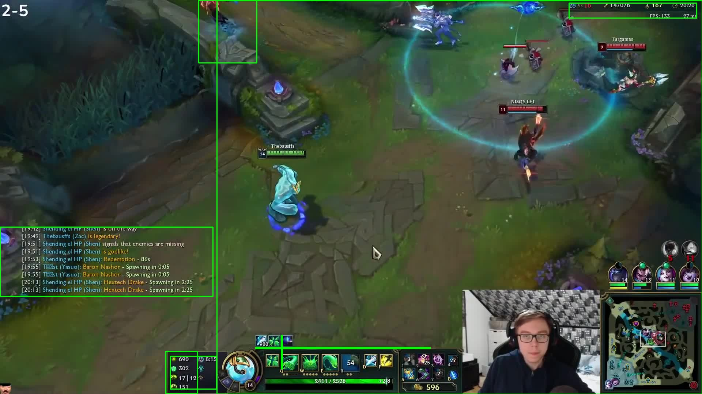
&nbsp; &nbsp; &nbsp; &nbsp;
  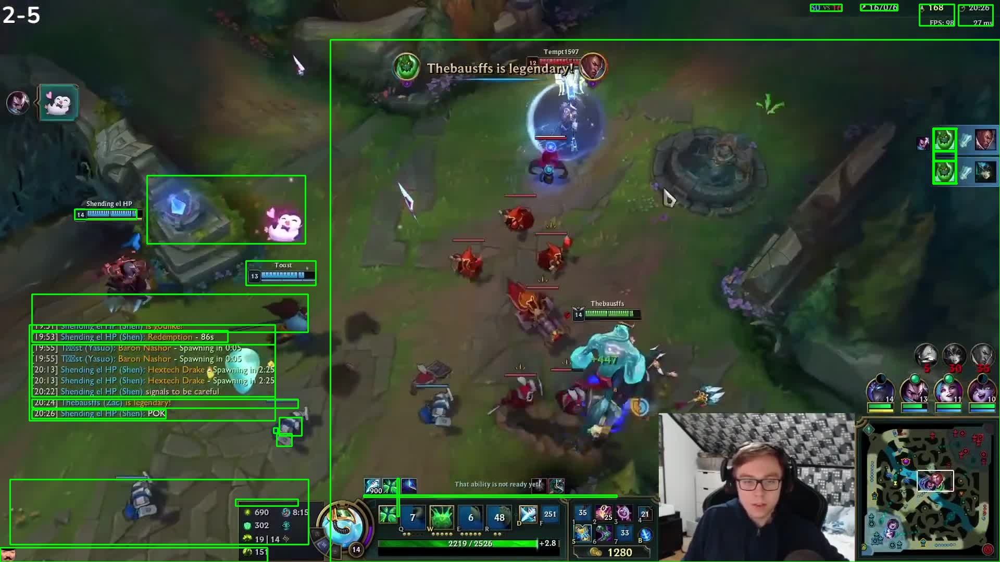
</p>

Between these two sequential frames, the bounding box given by tesseract around the in-game chat changes signficantly.

Other issues included the fact that some boxes would blit in and out (and not really contain real text) and that other boxes would be massive.

### Merging Boxes

To addres the problem that sometimes the same object would be split into different boxes (likely an effect of varying backgrounds as the game progresses) I first attempted to simply merge close boxes together. This was quite simple, and just involved finding the distance between boxes and replacing close ones with their union iteratively. Results on the same images below.

<p align="center">
  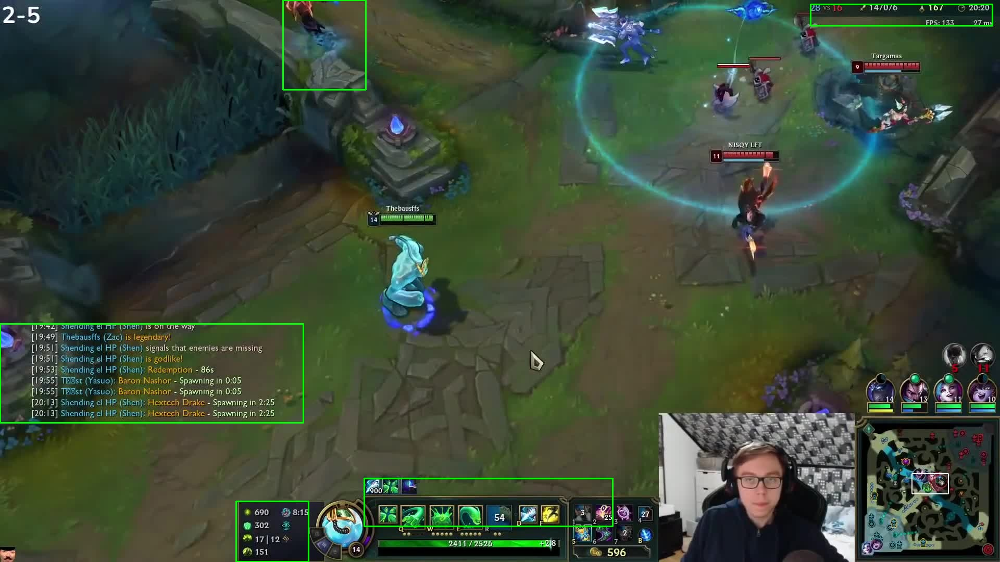
&nbsp; &nbsp; &nbsp; &nbsp;
  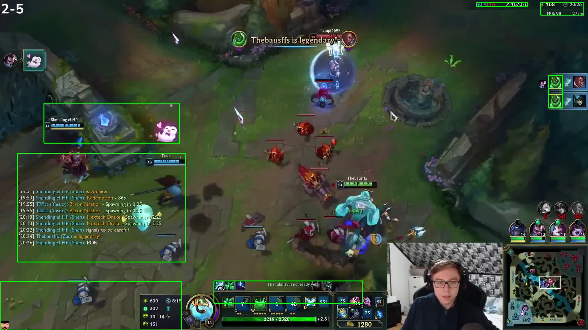
</p>

This simple fix helped a lot. It didn't completely solve the problem, but for many of what seem like the "easiest" text boxes to bound, it ensured subsequent frames had similar (and correct) bounding boxes.

### Custom Image Binarization

Before moving on to building the classifier and the processor, I wanted to try and squeeze out better performance from tessaract when it came to text recognition. I noticed that the model as I had been using it struggled with different colored backgrounds. I added in a step which binarized the images as they came in (before tessaract) to hopefully make the job of OCR easier.

<p align="center">
  
&nbsp; &nbsp; &nbsp; &nbsp;
  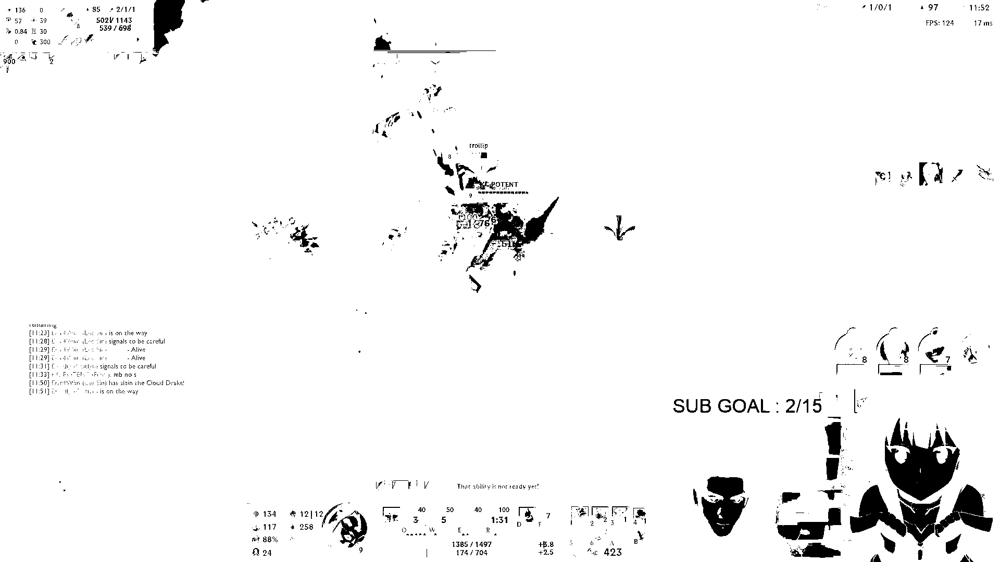
&nbsp; &nbsp; &nbsp; &nbsp;
  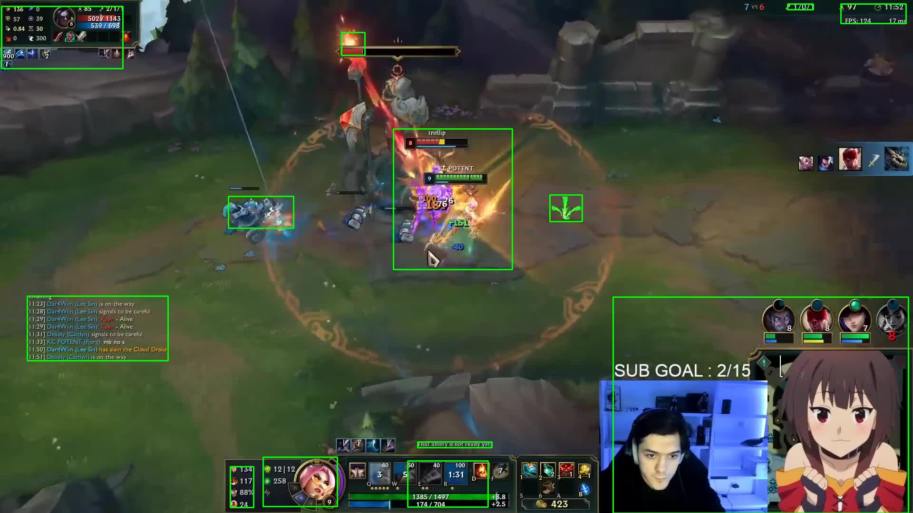
</p>

With this additional custom binarization step, I noticed (informally) better boxes, and a higher proportion of things like names, items, stats getting picked up.

### Future Work

I'm happy with the state that the pre-processor ended up at. Across streams, both in-game chat and twitch-chat seemed to be tracked relatively well, and a good chunk of auxillary information got captured as well (although much more inconsistently between frames).

However, given more time there are a few things (especially with an eye on robustness and performance) I'd like to go back and fix:

- Make the binarization step adaptive. The parameters I used in thresholding were found with trial and error. With more time I'd want to make this binarization step more adaptive to the image, and potentially take advantage of existing libraries.

- Make the number of frames used in pre-processing adaptive. Using every frame would be too slow. I settled on around one frame every two seconds in this initial stage, but ideally this should automatically adapt to the system at hand to maintain better than real time performance.

- Give the user more opportunity to influence how boxes are merged. The strategy of merging close boxes helps ensure things like chat are (almost) always bounded consistently, but mistakes creep in. For highly-consistent things (like twitch chat always being in the same place, item info in the same place) letting the user explicitly specify these areas earlier could improve accuracy throughout.

## Classification

Our next task is to give the user an easy (and fast) way to organize the text on the screen. We'll do three things to make this happen.

1. Perform some kind of clustering on the output regions with text from pre-processing. That way, we'll already have a sense of what is the same text group before we even ask the user. Note that we'll want to air on the side of more clusters, as in the next step there is a very convenient way for the user to inform us that two clusters should actually be the same.

2. Create a simple interface for the user to input a label to an area returned by tesseract.

3. (The hard part) Train a classifier to go from text area -> label as given by the user.

### Clustering on the Outputs

My first attempt was to simply extract out all of the boxes predicted (with timestamps) and then run these through mobilenet and do clustering on the predicted features.

<p align="center">
  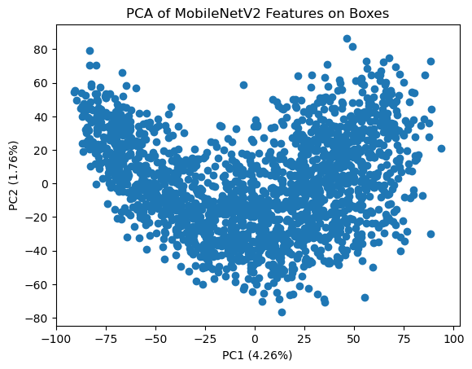
</p>

The above PCA graph shows that this process certainly extracted _some_ information from the data, but the low variance explained gives cause for concern.

My next idea to improve this was to also add information about the shape of the box and see if that helped create more obvious groups. I appended information about each boxes height and width to the features predicted by mobilenet, which gave a slightly more interesting shape.

<p align="center">
  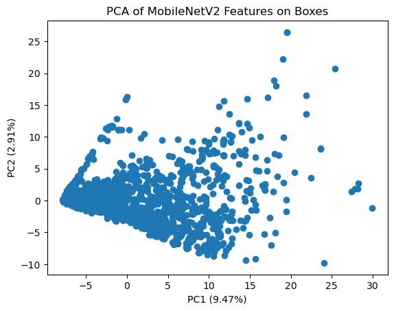
</p>

This seems potentially more useful. The variance explained by the first two components is significantly higher, and it seems plausible that clustering on this info would be helpful when it comes to determiningwhat kind of text a box corresponds to.

Finally, I performed the same analysis but only on the box metadata, including width and height, but also now top and left coordinates. Note that since in this case the data does indeed only have four dimensions, the PCA on two primary components should explain most of the variance (which it does). It's a good sanity check.

<p align="center">
  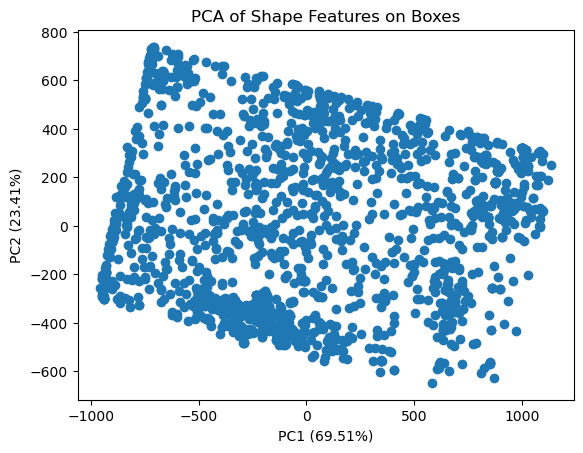
</p>

Up until now, the data I had been evaluating on was from the "Sack from the Yungle" compilation video. I thought that this would be a good place to start as it contains cuts from multiple streamers who use substantially different layouts.

However, I'm going to take a step back and now evaluate on a video from a single league streamer playing one game, with twitch chat and game chat in consistent places. This will (hopefully) allow me to build an accurate classifier using shape + features or just shape and begin building the next part of the pipeline. I can come back later and improve the pre-processing and classifying later to support more varied streams.

### Soliciting User Feedback

Now that we've got a good way of quantifying these text boxes and putting them on a sensible set of axes, it's time to start labelling them for the user.

I built a very simple GUI which will present an image to the user and ask them to provide a label. It's based on a random process which picks a box unlike the boxes that have already been labelled and soliciting feedback. The process terminates on it's own once a sufficient space in the output has been covered.

<p align="center">
  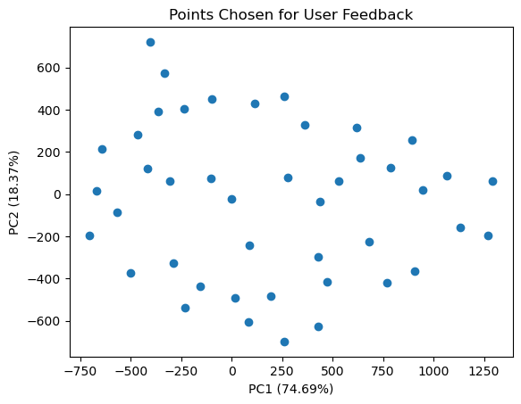
&nbsp; &nbsp; &nbsp; &nbsp;
  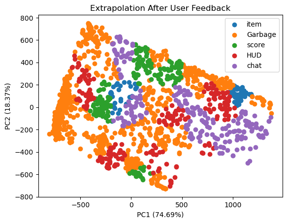
</p>

The images above show the result of this process. We start be identifying key points in the space of boxes detected, and then once those are labelled, can extrapolate with simple clustering to obtain labels for all of the boxes.

Notice that even after all we've done with pre-processing and classifying cleanup, there are still a large chunk of points which end up as "garbage".

## Producing the Final Output

After our pre-processing and our classifying, we're now left in a position where we have images of all the high-probability text boxes categorized into groups by the user.

We will simply go back through the frames in the order that they logically occurred and recreate the text logs with another pass of OCR.

### Attempt 1 with TrOCR

Although I used tesseract for the first round of bounding box detection, I wanted to try and use TrOCR for the actual final predictions for a couple reasons:

1. I wanted to experiment with how it performed relative to tesseract (both quality and speed)
2. It's default output more gracefully handles line-breaks and special characters, and (from reading docs) it seems less work would need to be done to recreate the actual text for things like twitch-chat

However, even after trying a number of optimizations on the dataset I was passing in, the inference time was still way too slow (shown below taking over an hour on a 25 minute video).

<p align="center">
  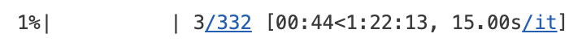
</p>
